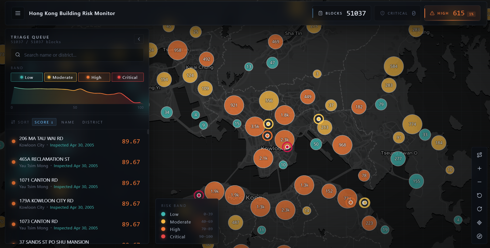
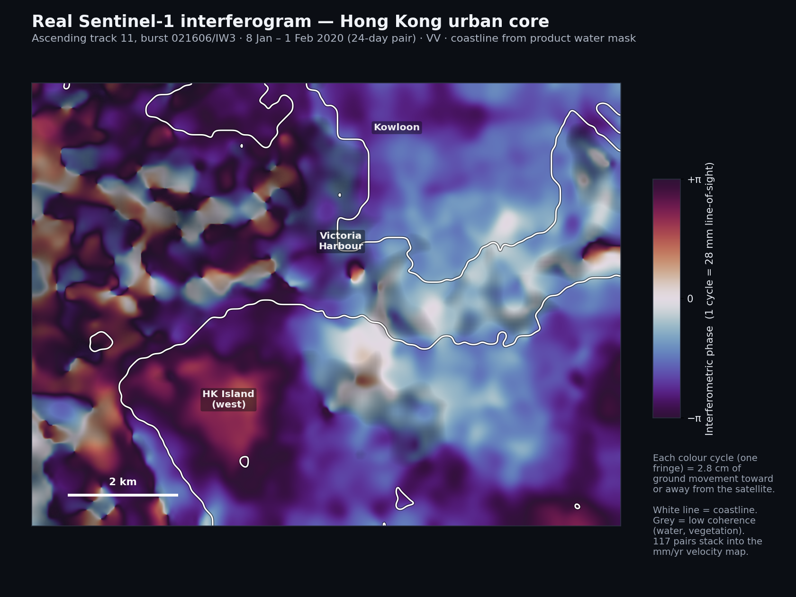
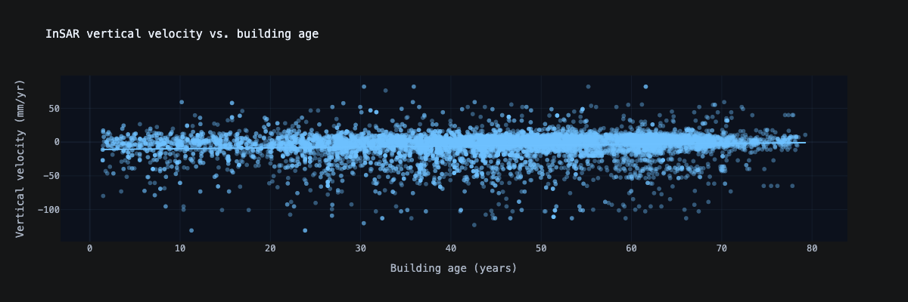

# HK Building Risk

Inspection-triage platform for Hong Kong building risk. A scoring/ML pipeline
ranks buildings by structural risk; an officer-facing dashboard triages them;
a resident app lets the public report issues. Both apps share one Supabase
(Postgres + Auth) database.

## Contents

- [Repository layout](#repository-layout)
- [The two apps](#the-two-apps)
- [Screenshots](#screenshots)
- [Shared database (Supabase)](#shared-database-supabase)
- [Running an app](#running-an-app)
- [ML pipeline](#ml-pipeline)
- [How the risk score works](#how-the-risk-score-works)
- [Road-crack layer](#road-crack-layer)
- [Data sources and acknowledgements](#data-sources-and-acknowledgements)
- [License](#license)

## Repository layout

```
hk-building-risks/
├── apps/
│   ├── web-app/        # officer triage dashboard (React + Vite + MapLibre)
│   └── resident-app/   # public-facing PWA for resident reports
├── supabase/           # shared database: schema, migrations, seed, config
├── ml/                 # data + models that produce the risk scores
│   ├── data-analysis/  # raw datasets + exploration notebooks
│   ├── model/          # feature engineering + baseline scoring
│   ├── insar/          # InSAR ground-deformation pipeline
│   └── cracks/         # crack-detection model (PyTorch)
└── docs/               # specs, product/legal notes, pitch decks
    ├── product/        # brainstorming, exploration, summaries
    ├── legal/          # inspection & product-overview notes
    ├── pitch/          # pitch decks (.pptx), pitch.md, STORYLINE.md
    └── spec.md
```

Each app and the `ml/` directory has its own README with detailed setup.

## The two apps

| App | Audience | Path | Notes |
|-----|----------|------|-------|
| **Web app** | Inspection officers | [`apps/web-app`](apps/web-app) | Map + triage queue + score breakdowns |
| **Resident app** | General public | [`apps/resident-app`](apps/resident-app) | PWA for submitting building reports |

Both connect to the **same** Supabase project using its public URL + anon key.
Set those up once (below), then each app gets its own `.env` from its
`.env.example`.

## Screenshots



## Shared database (Supabase)

You need the [Supabase CLI](https://supabase.com/docs/guides/cli) and a Supabase
project. From **Project Settings → API** copy the **Project URL** and **anon
public** key — both apps use these. The anon key is safe in the browser; the DB
is protected by Row Level Security.

### Apply migrations

```bash
supabase link --project-ref <your-project-ref>
supabase db push
```

This applies the migrations in `supabase/migrations/`:

<details>
<summary>Migrations applied by <code>db push</code></summary>


- `20260606120000_initial_schema.sql` — tables (`blocks`, `scores`,
  `inspections`, legacy `schedule`), the `blocks_with_status` view, triggers.
- `20260606120100_security_policies.sql` — RLS policies. **Anonymous users get
  zero access.** Authenticated users can read blocks/scores/inspections and
  write inspections + the per-block note; everything else is read-only from the
  client and managed by the scoring pipeline / admin import.
- `20260606120300_remove_schedule.sql` — derives status from inspection history.
- `20260606120400_import_scores.sql` — narrow authenticated score-import
  function used by the web app's CSV import.
- `20260606130000_resident_reports.sql` — resident report submissions.

</details>

### (Optional) Seed with mock data

`supabase/seed.sql` contains 50 HK blocks with a few per-factor scores:

```bash
supabase db reset                              # wipe + re-seed LOCAL stack
# or apply to a linked REMOTE project (one-time):
supabase db execute --file supabase/seed.sql
```

### Create the first user

Sign-up is disabled (`enable_signup = false`, invite-only). In the dashboard:
**Authentication → Users → Invite user**. For local dev (`supabase start`), read
the invite via [Inbucket](http://localhost:54324).

## Running an app

```bash
cd apps/web-app        # or apps/resident-app
nvm use                # Node 22 (repo .nvmrc)
npm install
cp .env.example .env   # fill in the shared Supabase values
npm run dev
```

## ML pipeline

The risk scores the apps display come from `ml/`. See
[`ml/README.md`](ml/README.md). Python managed with [uv](https://docs.astral.sh/uv/).

## How the risk score works

Each block gets a 0 to 100 risk score from a weighted blend of building
attributes (age, type, statutory-notice history) and ground deformation measured
by satellite radar (InSAR). Differential settlement is a strong predictor of
structural distress, so blocks over subsiding ground rank higher.



*Sentinel-1 InSAR interferogram over Hong Kong. Each colour cycle is ground
displacement along the satellite line of sight.*



## Road-crack layer

The crack markers on the map are a heuristic for figuring out the places where
cracks are likely to occur, derived from InSAR velocity gradients (differential
ground settlement is a primary driver of pavement cracking). They flag candidate
areas rather than confirmed defects. Drone and satellite computer vision is
intended as the secondary confirmation step for these flagged areas. See
[`honesty.md`](honesty.md).

## Data sources and acknowledgements

- **Hong Kong building stock and inspection records** from the Buildings
  Department ([bd.gov.hk](https://www.bd.gov.hk/)).
- **Sentinel-1 SAR** imagery from the European Space Agency, accessed via the
  [Alaska Satellite Facility](https://search.asf.alaska.edu/).
- **Crack-detection training data**: CRACK500 (asphalt) and the Ozgenel concrete
  crack dataset; see [`ml/cracks/README.md`](ml/cracks/README.md).

These carry their own upstream licenses, separate from this repository's MIT
license. See [`honesty.md`](honesty.md) for the full tool and data disclosure.

## License

MIT, see [`LICENSE`](LICENSE). This covers the code in this repository only.
Datasets (bd.gov.hk official records, Sentinel-1 SAR) and trained model weights
carry their own upstream licenses; see [`honesty.md`](honesty.md) and the
dataset notes in [`ml/cracks/README.md`](ml/cracks/README.md).
